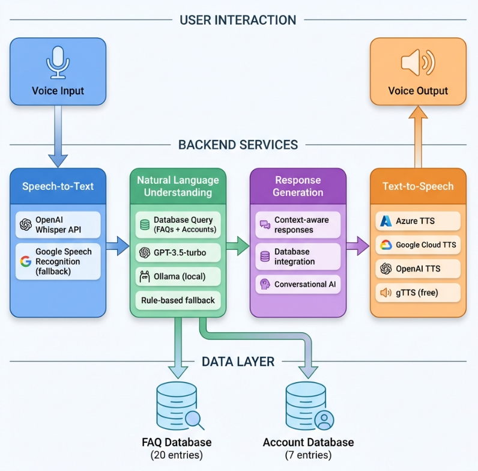
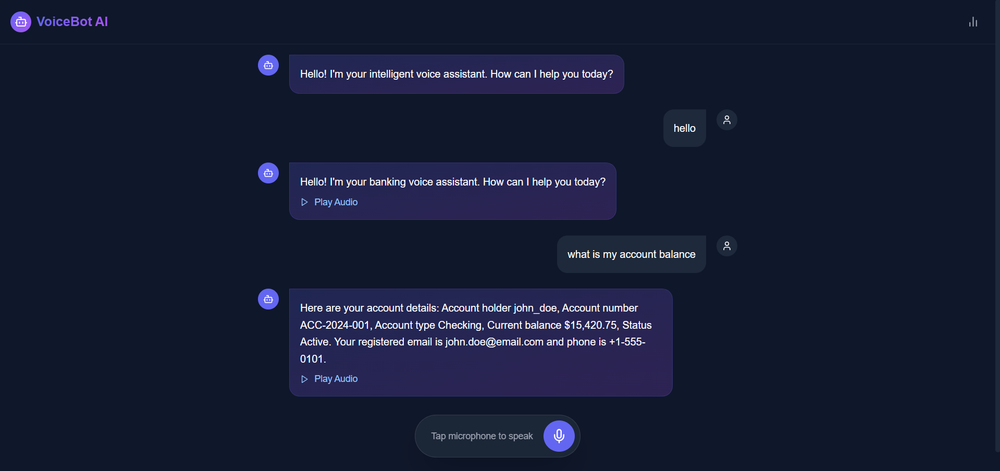

# 🤖 Intelligent Voice Bot for Banking

👉 Live Hosted Demo: https://voice-bot-frontend.onrender.com

A full-stack AI Voice Assistant capable of handling banking queries, checking account balances, and answering FAQs using natural language. Built with **React**, **FastAPI**, **OpenAI/Ollama**, and **Speech-to-Text/Text-to-Speech** technologies.



## ✨ Features

- **🗣️ Voice Interaction**: Talk to the bot naturally using your microphone.
- **⌨️ Text Input**: Type queries directly if you prefer not to speak.
- **🧠 Intelligent NLU**: Uses GPT-3.5 (or local Ollama) to understand context and intent.
- **🏦 Banking Operations**: Check balances, account details, and transaction history.
- **⚡ Real-time Response**: Low-latency responses with visual feedback.
- **📊 Analytics Dashboard**: Track query counts and response times.
- **🎨 Modern UI**: Beautiful dark-mode interface built with React & TailwindCSS.



## 🛠️ Tech Stack

### Frontend
- **Framework**: React 18 + Vite
- **Styling**: TailwindCSS + Framer Motion
- **Icons**: Lucide React
- **Audio**: Web Audio API + AudioRecorderPolyfill

### Backend
- **Server**: FastAPI (Python)
- **Database**: SQLite (SQLAlchemy)
- **AI Services**: 
  - **STT**: OpenAI Whisper / Google Speech Recognition
  - **LLM**: OpenAI GPT-3.5 / Ollama (Llama3/Mistral)
  - **TTS**: OpenAI TTS / Google Cloud TTS / Azure TTS / gTTS

---

## 🚀 Quick Start Guide

### Prerequisites
- Node.js (v16+)
- Python (v3.8+)

### 1. Setup Backend
```bash
cd backend
python -m venv venv

# Windows
venv\Scripts\activate
# Mac/Linux
# source venv/bin/activate

pip install -r requirements.txt

# Create .env file with your API keys (see .env.example)
# Run database seed
python seed_db.py

# Start Server
uvicorn main:app --reload --port 8000
```

### 2. Setup Frontend
Open a new terminal:
```bash
cd frontend
npm install
npm run dev
```

### 3. Run
Open your browser and visit: **http://localhost:5173**


---

## 🔑 Environment Variables

Create a `.env` file in the `backend/` folder:

```env
# Required for best experience
OPENAI_API_KEY=sk-...

# Optional: For Google Cloud TTS
GOOGLE_APPLICATION_CREDENTIALS=path/to/credentials.json

# Optional: For Azure TTS
AZURE_SPEECH_KEY=your_key
AZURE_SPEECH_REGION=eastus
```

## 📂 Project Structure

```
voice_bot_project/
├── backend/              # FastAPI Server
│   ├── services/         # NLU, STT, TTS logic
│   ├── database.py       # SQLite models
│   └── main.py           # API Endpoints
├── frontend/             # React Application
│   ├── src/              # Components & Hooks
│   └── public/           # Static assets
└── screenshots/          # Documentation images
```

## 🤝 Contributing

1. Fork the repository
2. Create your feature branch (`git checkout -b feature/AmazingFeature`)
3. Commit your changes (`git commit -m 'Add some AmazingFeature'`)
4. Push to the branch (`git push origin feature/AmazingFeature`)
5. Open a Pull Request

## 📄 License

Distributed under the MIT License.
